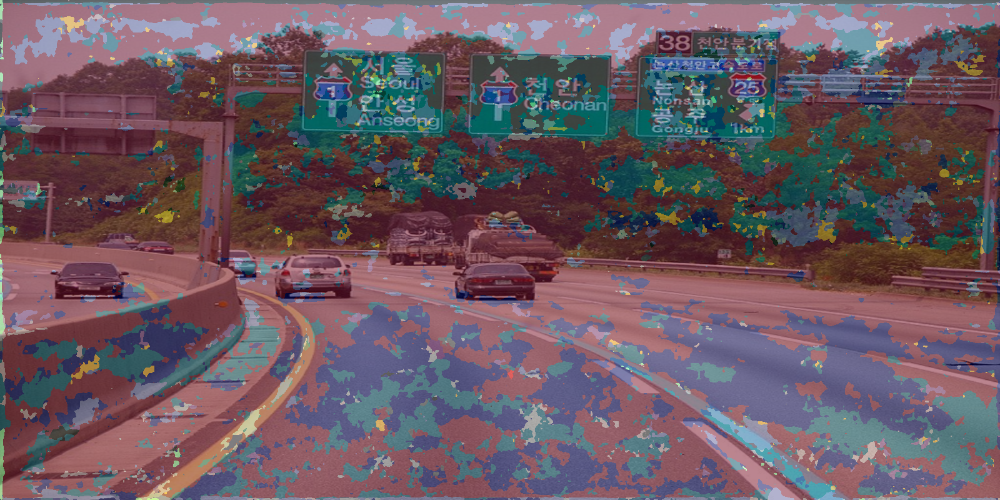

# DeepVisions_repo

## 1. DeepLabV3+
tf2 \
bb, ResNet50 \
\+ Atrous Spatial Pyramid Pooling

### raw

### output

### trained weights
[model_v2]( https://drive.google.com/file/d/10EBMPQvXulhmMphpqLgsyVX_5YrDVRYs/view?usp=sharing)

### to do
- [x] python packaging
- [ ] metrics extraction
