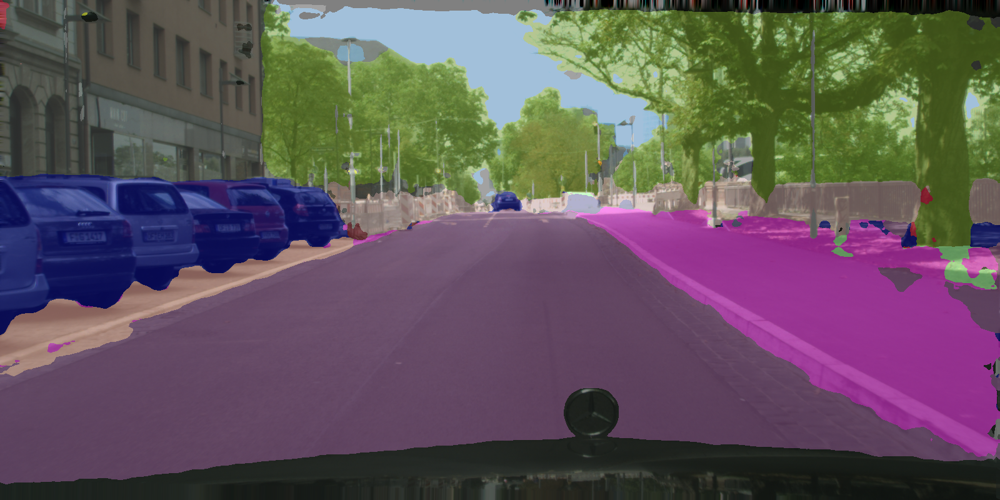
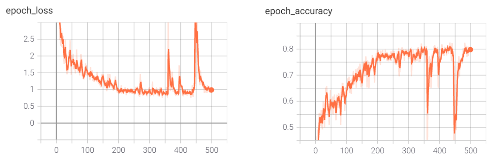

# DeepVisions_repo

## 1. DeepLabV3+
semantic segmentation \
tf2 \
bb, ResNet50 \
\+ Atrous Spatial Pyramid Pooling

### example
<p align="left">
    </br>
</p>

### trained weights
~~[***model_v2***](https://drive.google.com/file/d/10EBMPQvXulhmMphpqLgsyVX_5YrDVRYs/view?usp=sharing): *top performance among 500 epochs below*~~
<p align="left">
    </br>
</p>

### how to use
```
(1) upload png files to the 'images' folder
(2) sh apps.sh
(3) see the results in the 'outputs' folder
```

### to do
- [x] OA evaluation
- [x] python packaging
- [ ] package upload
