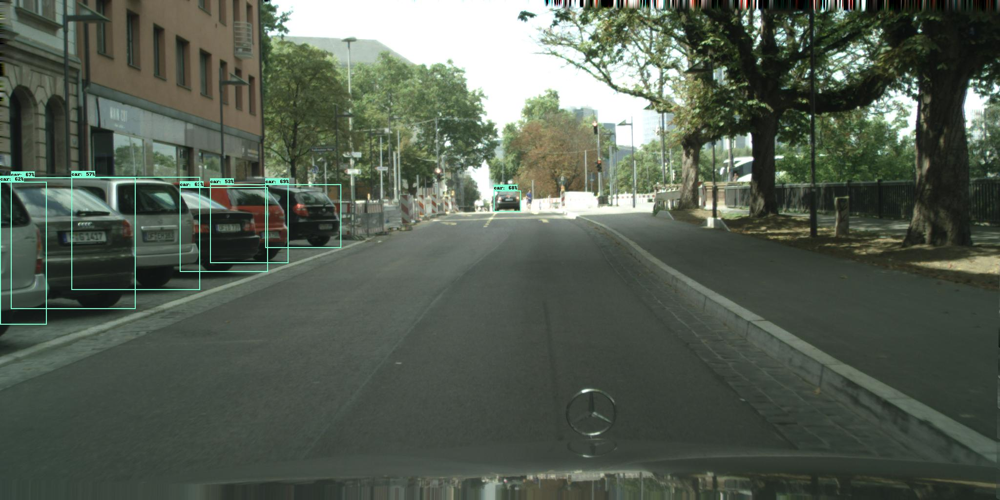

*Author's Note: I've tried to make codes as short and readable as possible bc I DISLIKE TOO LONG AND SPECIFIC CODES HARD TO UNDERSTAND.*

# 1. DeepLabV3+
It attempts to reproduce [***DeepLabV3+***](https://arxiv.org/abs/1802.02611) semantic segmentation model based on tf2.

## example
<p align="left">
    </br>
</p>

## how to use
```
(1) upload png files to the 'images' folder
(2) sh apps.sh
(3) see the results in the 'outputs' folder
```

## to do
- [x] OA evaluation
- [x] python packaging
- [ ] package upload

# 2. EfficientDet
It attempts to reproduce [***EfficientDet***](https://arxiv.org/abs/1911.09070) object detection model based on tf2.

## example
<p align="left">
    </br>
</p>

## how to use
```
(1) upload png files to the 'images' folder
(2) sh apps.sh
(3) see the results in the 'outputs' folder
```

## to do
- [ ] OA evaluation
- [ ] python packaging
- [ ] package upload
